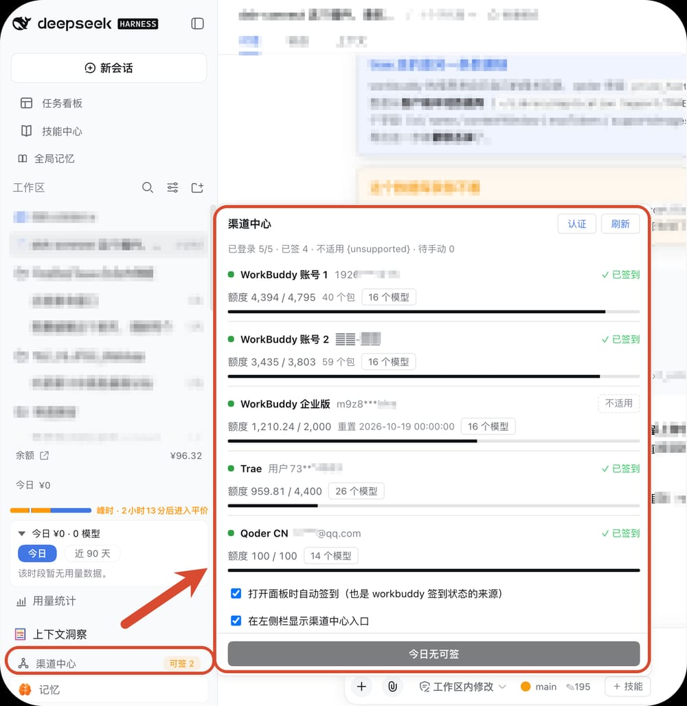
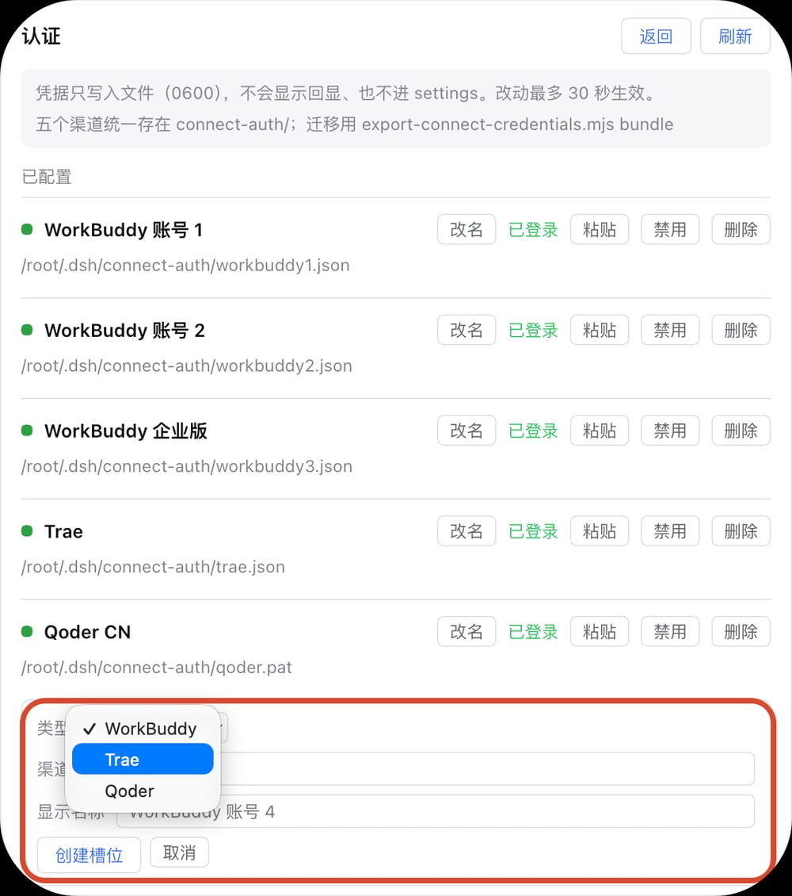
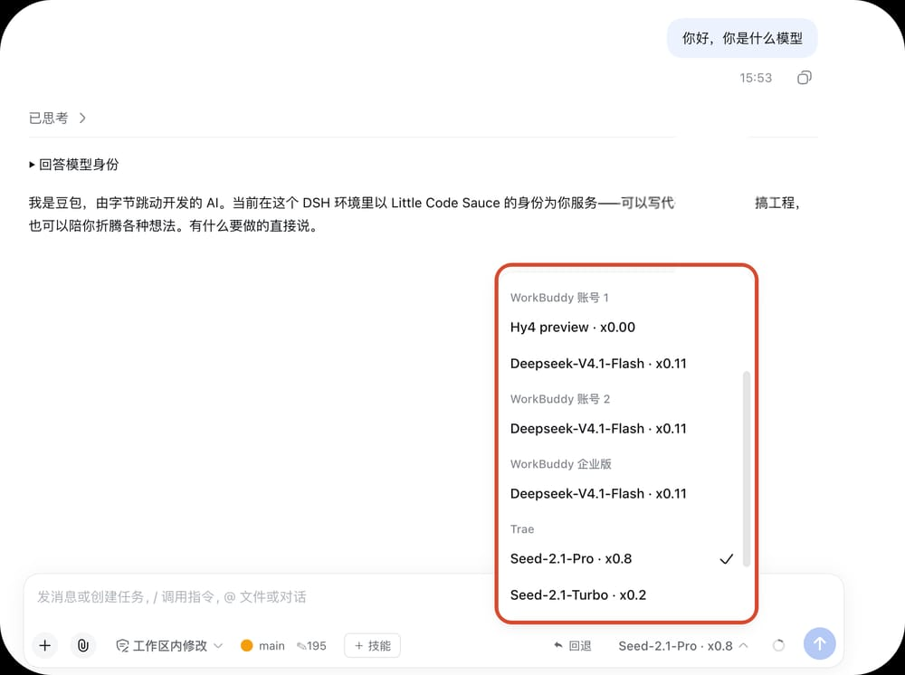

# dsh-connect

一个 DSH 插件：把 **WorkBuddy**（含企业版，账号数不限）、**Trae**、**Qoder CN** 三个渠道的模型
一次接进 DSH，并给它们配一块统一面板 —— 看状态、签到、增删渠道，都在这一块里完成。

> 2026-09-24 由四个插件合并而来：`dsh-workbuddy-connect` + `dsh-trae-connect` +
> `dsh-qoder-connect` + `dsh-connect-hub`。

---

## 这是干什么的

这三个渠道各自都有官方客户端，但在 DSH 里用起来是三套东西：分别装、凭据散在三处、
状态要在不同地方看。这个插件把三件事收拢在一起：

- **模型**：三家模型进同一个模型选择器，选谁就是谁，不用来回切插件；
- **状态**：所有账号的登录、额度、今日签到，一屏看完；
- **渠道**：加号、换号、停用、删除，在一个面板里点完。

## 有什么功能

| 功能 | 在哪 | 说明 |
|---|---|---|
| 三家模型接入 | 模型选择器 | WorkBuddy / Trae / Qoder 的模型并列可选 |
| **倍率显示** | 模型选择器、面板 | 每个模型名后面跟着当前倍率，选之前就知道贵不贵 |
| 状态面板 | 左侧栏「渠道中心」 | 各账号的登录状态、额度进度、签到状态、模型数 |
| 一键签到 | 面板底部 | 一次领完所有渠道的每日额度 |
| 渠道管理 | 面板 → 认证 | 添加、改名、粘贴凭据、停用、删除 |
| 模型筛选 | 面板 →「模型 N」 | 决定哪些模型出现在模型选择器里 |
| 自动签到 | 面板底部开关 | 打开面板时顺手把能领的领了 |

## 怎么用

### 一、看状态：左侧栏的「渠道中心」

入口在左侧栏底部，和「用量统计」「上下文洞察」「记忆」排在一起。有可领的额度时，
它右边会亮一个「可签 N」的标签；侧栏收成图标条时，就是一个带小圆点的图标。



点开是面板：

- **顶部**一句话汇总：已登录几个、已签几个、哪些不适用；
- **中间**每个渠道一行：左边状态点 + 账号（打码显示），右边是这一行的签到动作；
  下一行是额度进度、重置时间、模型数；
- **底部**是「一键签到」，以及两个开关 —— 打开面板时自动签到、在左侧栏显示入口。

面板开着时每两分钟自动刷新；关掉就不再轮询，不会在后台一直打接口。

### 二、管渠道与凭据：认证页

点面板右上角「认证」切过去，这里列出每个渠道的**凭据落点**和当前登录状态。



每行右边四个动作：

- **改名** —— 只改显示名，不动凭据；
- **粘贴** —— 把凭据内容贴进去，直接写进该渠道的文件，最多 30 秒生效；内容不会回显，
  也不会进 DSH 的设置文件；
- **停用** —— 该渠道的所有模型从模型选择器消失、也不参与一键签到，但**凭据留着**，
  随时可以启用回来（立刻生效）；
- **删除** —— 连凭据一起删掉（要点两次确认），槽位回到空闲，可以重新添加。

底部「创建槽位」用来加新渠道：选类型、填一个 id、写个显示名。WorkBuddy 能加任意多个，
Trae 和 Qoder 各一个。新增之后面板里立刻能看到这一行，但要**重启 DSH** 之后，
它的模型才会进模型选择器。

#### 凭据放在哪

三家读同一个目录：容器里是 `/root/.dsh/connect-auth/`，宿主机就是 `~/.dsh/connect-auth/`。
一个渠道一个文件，都是 **0600 明文** —— 所以别提交进 git，也别贴到公开的地方。

| 渠道 | 文件 | 关键字段 |
|---|---|---|
| WorkBuddy 各账号 | `workbuddy<N>.json` | `auth.accessToken`、`auth.refreshToken`（插件靠它自动续期） |
| Trae | `trae.json` | `token`、`deviceId`、`appVersionCode` |
| Qoder CN（优先） | `qoder-session.json` | `token`（`dt-` 开头） |
| Qoder CN（兜底） | `qoder.pat` | 一行纯文本，`pt-` 开头 |

#### 凭据的格式

**`workbuddy1.json`** —— 就是桌面 App 存的那份结构，外层是账号、里层是令牌：

```json
{
  "account": { "nickname": "…", "phoneNumber": "…", "type": "personal" },
  "auth": {
    "accessToken": "…",
    "refreshToken": "…",
    "expiresAt": 1790000000000,
    "tokenType": "Bearer",
    "domain": "www.workbuddy.cn"
  }
}
```

企业版账号在这个结构里带企业标识，插件据此改发企业版请求头、并改问企业版额度接口 ——
个人版接口对企业号会返回空账户表，界面上就成了"0 积分"。

**`trae.json`** —— 由导出脚本生成，字段固定：

```json
{
  "formatVersion": 1,
  "gateway": "https://…",
  "appVersionCode": 1227681842690,
  "token": "…",
  "refreshToken": "…",
  "userId": "…",
  "deviceId": "…",
  "account": { "username": "…", "scope": "marscode" }
}
```

三个字段是承重的：`deviceId` 缺了签到会被上游拒（`9004`）；`appVersionCode` 是倍率接口的
筛选键，写错或漏掉**不报错，只是倍率整列空白**；`token` 过期则模型直接不可用。

**`qoder-session.json`**：

```json
{ "token": "dt-…", "refreshToken": "…", "expiresAt": "2026-10-23T17:10:56Z", "uid": "…" }
```

#### 怎么获取

凭据都在各个桌面 App 的加密存储或系统钥匙串里，所以**只能在装了对应 App 的机器上导**，
导完直接落在上面那个目录，**30 秒内生效，不用重启**。导出脚本随插件一起发布
（就在本仓库的 `scripts/` 下），统一入口是一条命令：

```sh
node scripts/export-connect-credentials.mjs                          # 能自动导的全导 + 只读校验
node scripts/export-connect-credentials.mjs workbuddy --account 2    # 只导某个账号
node scripts/export-connect-credentials.mjs trae
node scripts/export-connect-credentials.mjs qoder                    # 自动解 App 登录态
node scripts/export-connect-credentials.mjs qoder --pat pt-xxxx      # 或直接给官方 PAT
node scripts/export-connect-credentials.mjs verify                   # 只校验，不写文件
```

各家要注意的地方：

- **WorkBuddy** —— 凭据由 App 自带的 Electron 解封。**App 同时只保持一个登录**，
  要导哪个账号就先在 App 里切到哪个；个人号与企业号各导一次。
- **Trae** —— 登录态在客户端本地库里，解密是纯算法、不碰系统钥匙串，装过 Trae 就能导。
- **Qoder** —— 优先解 App 的本地会话，读钥匙串时系统可能弹一次授权框；
  解不出来就用官方 PAT 兜底。

**不想跑脚本**：认证页每行的「粘贴」接受凭据原文，直接写进对应文件 ——
适合从别的机器拷一份过来、或者临时换账号。

> 脚本默认去连名为 `dsh-harness` 的容器读面板状态（只读校验那一步），换个部署名用
> `DSH_CONTAINER=…` 覆盖即可；在容器里跑时这一步会自动跳过，不影响导出本身。

### 三、选模型：倍率就在名字里

模型选择器里每个模型名后面跟着它**当前**的倍率，一眼能看出哪家便宜。



- 倍率是**实时取**的，不是写死的常量 —— 各家调价后会跟着变；
- 写法跟各自平台一致：WorkBuddy 是 `x0.11` 这种，Trae 是 `x0.72`，Qoder 是 `0.5×`；
- 个别模型后面没有倍率，是上游本身没给（比如 Qoder 的 `Qwen3.8-Flash`），不是漏了。

### 四、挑模型：不想看的可以关掉

渠道行上有个「模型 N」按钮，点开是勾选列表：勾上就出现在模型选择器里，取消就不出现，
改完立刻生效。整条渠道都不想要，「认证」页的「停用」更省事。

## 什么时候需要重启

| 你做了什么 | 什么时候生效 |
|---|---|
| 改凭据（粘贴、换号） | 最多 30 秒 |
| 停用 / 启用渠道、勾选模型、改偏好 | 立刻 |
| 新增 / 删除渠道、改名 | 面板立刻可见，但模型要**重启 DSH** 才跟上 |
| 升级插件 | 重启 DSH |

## 排错

**先看面板**：每一行的状态点和文字已经说明了大半问题，那一行异常时下面通常还会跟一句错误说明。

| 现象 | 多半是 | 怎么办 |
|---|---|---|
| 左侧栏看不到「渠道中心」 | 入口被关掉了 | 面板底部那个「在左侧栏显示渠道中心入口」开关勾回来（设置 → 插件 → DSH Connect 里也有） |
| 某个渠道显示「未响应」 | 上游一时超时，或凭据掉了 | 等几分钟再刷新；一直这样就去认证页看它的凭据还在不在 |
| 模型选择器里少了一家的模型 | 该渠道未登录，或刚新增渠道还没重启 | 认证页看状态；新增渠道要重启 DSH |
| 签到按钮点不了，或显示「不适用」 | 该渠道没有签到动作（企业账号），或活动没开 | 不用管，这是上游本身的限制 |
| 某些模型没有倍率 | 上游没给 | 正常，有就给、没有不硬凑 |
| 面板打开是空的 | 面板服务没起来 | 重启 DSH |

## 更多

- `docs/` 里放着面板设计、各渠道的接入方案与排错笔记；
- 想看实现细节（倍率从哪取、为什么这么接线、踩过哪些坑），看源码注释 —— 每个文件头部
  和关键函数上都有说明。
